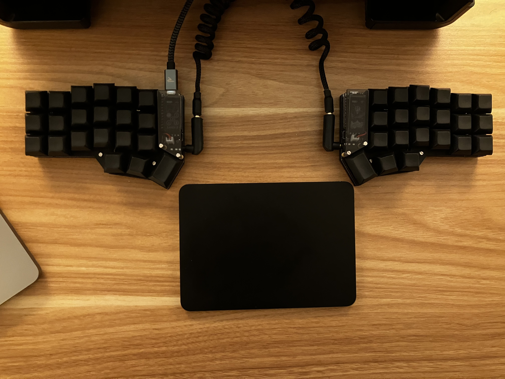
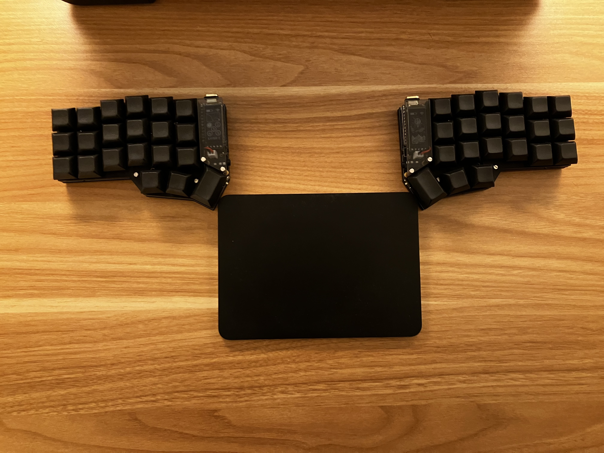
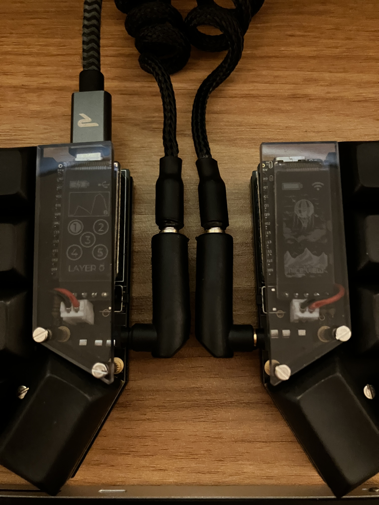

# zmk-corne

splitkb.com Aurora Corne ZMK Config with nice!nano and nice!view

## Builds

Builds are available on [Actions](https://github.com/kakkoyun/zmk-corne/actions/workflows/build.yml) as artifacts.

### Download the latest firmware

```shell
gh api -H "Accept: application/vnd.github+json" /repos/kakkoyun/zmk-corne/actions/artifacts | jq ".artifacts[0].archive_download_url" | xargs gh api > dist/firmware.zip
# OR
make latest
```

## Layout


> Drawn with [Keymap Drawer](/caksoylar/keymap-drawer)

---

## Photos

[](img/wired.jpeg)
[](img/wireless.jpeg)
[](img/nice!view.jpeg)

## Inspiration

- https://github.com/urob/zmk-config
- https://github.com/minusfive/zmk-config
- https://github.com/SethMilliken/swept-corne-zmk
